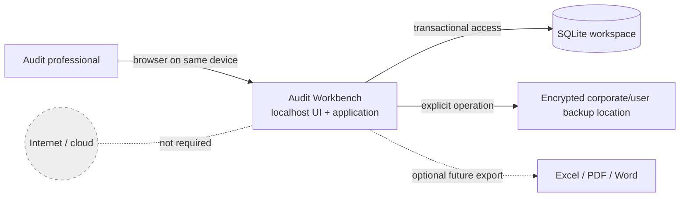
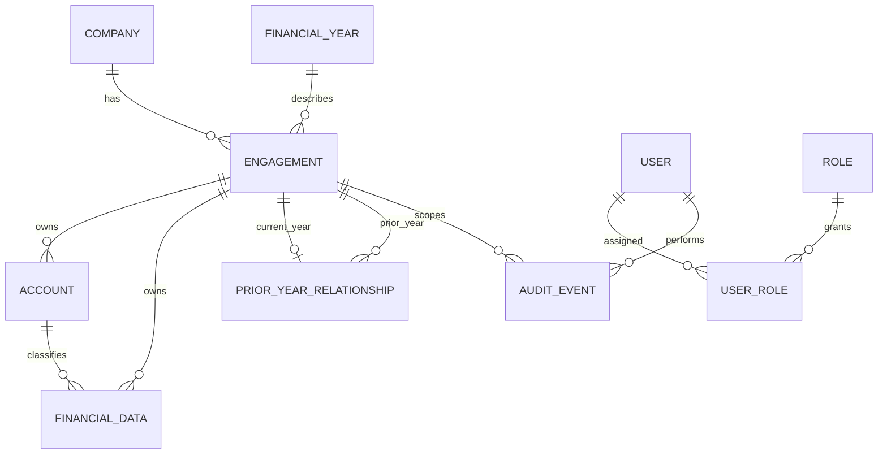
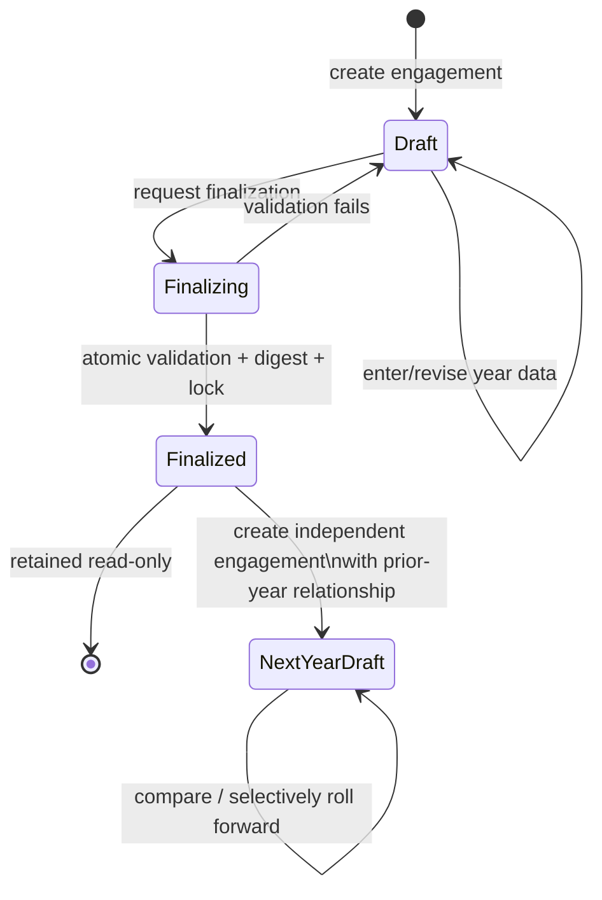

# Audit Workbench

Architecture, product specification and **first MVP implementation** of a local, portable audit-management and working-papers application.

> All names and values in these documents are synthetic examples. Development and test data must never contain real client information.

## Architectural direction

Audit Workbench is evolving into a **team-first .NET audit management system**. The production target is an authenticated Application/API with a central PostgreSQL database and external evidence storage. The existing Razor Pages + SQLite MVP remains intact for local development, automated tests, and invariant verification; SQLite is not the live multi-user production database. See `docs/architecture.md`.

The central invariant is:

> A company is master data; each financial year is a separate engagement boundary. Finalizing an engagement makes all of its year-owned records immutable to normal application operations. A later year references or copies from the finalized prior engagement—it never repurposes or updates that engagement.

## Repository layout

| Path | Contents |
|---|---|
| `src/AuditWorkbench.Domain` | Entities, invariants, money policy, manifest grammar, comparative maths |
| `src/AuditWorkbench.Infrastructure` | SQLite workspace, migration runner, EF Core mapping, backup writer |
| `src/AuditWorkbench.Application` | Use-case services, audit trail, finalization, demo dataset |
| `src/AuditWorkbench.Web` | Razor Pages UI, loopback-only host (`AuditWorkbench.exe`) |
| `db/migrations`, `db/sql` | The shipped schema, integrity guards and read queries |
| `tests/` | xUnit suites for the domain and for the services against a real SQLite file |
| `tools/verification/` | Python harness that runs the same SQL and proves the invariants — see its [README](tools/verification/README.md) |
| `docs/` | Specification and decision records |

## Build, test and run

```bash
dotnet build AuditWorkbench.sln
dotnet test AuditWorkbench.sln
dotnet run --project src/AuditWorkbench.Web
```

The application opens a browser on `http://localhost:<port>`, listening on the loopback interface
only. Its workspace (database, backups, logs) is created under `%LocalAppData%\AuditWorkbenchData`,
or under the folder named by the `AUDITWORKBENCH_WORKSPACE` environment variable — no installer, no
administrator rights, no service, no network. The dashboard can seed a clearly labelled synthetic
demo company (ABC Manufacturing (Demo) Limited) with FY2026 finalized and FY2027 open.

The invariants can also be verified without a .NET SDK, directly against the shipped SQL:

```bash
python3 tools/verification/run_verification.py
```

## MVP

The first MVP proves the year-isolation design only:

1. Create a company and a financial-year engagement.
2. enter a small set of financial values;
3. finalize and lock that engagement;
4. create the next engagement and explicitly link the finalized prior year;
5. enter independent current-year values and show comparisons;
6. export/import a complete client history using the validated `AWB-CLIENT/1.0` handover format; and
7. demonstrate, through UI behavior, database constraints, audit events, and tests, that current-year work cannot alter the prior year.

Trial-balance import, planning, risks, materiality, working papers, review, findings, sign-off workflows, and document exports are deliberately outside this MVP.

## System context



## Documentation

| Document | Purpose |
|---|---|
| [Requirements](docs/requirements.md) | Scope, actors, functional/non-functional requirements, and acceptance criteria |
| [Architecture](docs/architecture.md) | Recommended stack, component design, portability, alternatives, testing, and roadmap |
| [Data model](docs/data-model.md) | Entity model, engagement ownership, constraints, revisions, prior-year links, and schema outline |
| [Security model](docs/security-model.md) | Threats, authentication direction, authorization, integrity, backups, and operational controls |
| [Audit-year lifecycle](docs/audit-year-lifecycle.md) | State machine, finalization protocol, prior-year creation, and roll-forward rules |
| [MVP scope](docs/mvp-scope.md) | Included/excluded behavior, demo scenario, acceptance tests, and phased delivery plan |
| [Decisions](docs/decisions.md) | Architecture decision records, assumptions, and deferred decisions |
| [Foundation contract](docs/foundation.md) | Implemented identity, authorization, ownership, concurrency, audit and `.awb` boundaries |

## Key diagrams

### Entity overview



### Audit-year lifecycle



Finalized is intentionally terminal. Exceptional reopening, if ever approved, will be a separately designed, privileged, fully audited process—not an ordinary status toggle.

## Recommended delivery phases

1. **Specification baseline:** agree invariants, acceptance criteria, schema concept, security boundaries, and decisions.
2. **Technical skeleton:** portable packaging proof, loopback-only host, SQLite migrations, health/startup handling, and no business UI beyond a diagnostic shell.
3. **Company and engagement core (implemented):** master data, year creation, explicit ownership, validation, and audit event infrastructure.
4. **Financial data and comparison (implemented):** append-only revisions, prior-year link, comparative query, and synthetic fixture.
5. **Finalization controls (implemented):** preflight, transaction, immutable-state database guards, digest/manifest, backup prompt, and negative tests.
6. **MVP hardening:** local identity/RBAC baseline, backup/restore validation, accessibility, failure recovery, packaging, and user acceptance testing.
7. **Post-MVP modules:** trial balance/mapping, materiality/risk/planning, procedures/working papers/review, findings/sign-off, controlled roll-forward, and exports.

No phase should begin by weakening the engagement boundary or treating “year” as a mutable field on one audit record.
