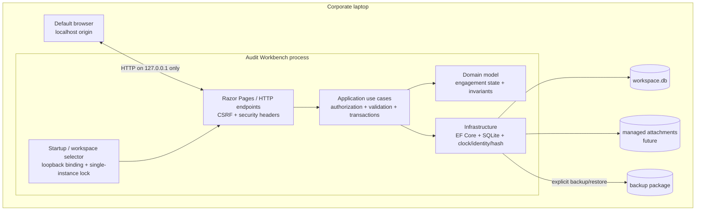

# Architecture

> **Team-first revision:** Production now targets an authenticated Application/API, central PostgreSQL (SQL Server-compatible provider boundary), and `IFileStorage`. SQLite and the local host described below are the preserved MVP/test implementation, not the live team topology. See [team-architecture.md](team-architecture.md), [concurrency-model.md](concurrency-model.md), [storage-architecture.md](storage-architecture.md), and ADR-020.

## 1. Recommendation

Build a modular monolith using:

| Layer | Recommended technology | Rationale |
|---|---|---|
| Runtime/host | .NET 8 LTS, self-contained x64 Windows publish | Mature, supportable, bundled runtime; no admin or machine-wide runtime install |
| Local web host | ASP.NET Core/Kestrel, loopback-only, random available port | Local browser UX without a Windows service or inbound network exposure |
| UI | Server-rendered Razor Pages with small progressive-enhancement JavaScript | Fewer moving parts and no Node runtime in the deployed product; straightforward forms and accessibility |
| Application | C# use-case services/commands and queries | Centralizes authorization, lifecycle, transaction, and audit rules outside controllers/pages |
| Persistence | SQLite through EF Core, with explicit migrations and targeted SQL triggers | Portable single workspace database, transactions, constraints, and supported .NET integration |
| Files (future) | Managed content-addressed attachment directory plus manifest/checksums | Avoids database bloat while keeping files inside backup/finalization boundaries |
| Tests | xUnit, architecture/unit tests, SQLite integration tests, Playwright UI smoke tests | Tests actual SQLite behavior and end-to-end locking, not an incompatible in-memory substitute |
| Packaging | Versioned ZIP containing self-contained executable and assets | Extract/run from a normal user directory; reproducible checksummed releases |

Use the latest supported patch of the chosen .NET 8 LTS line and pinned, reviewed dependencies. A move to a newer LTS should be an explicit compatibility decision.

## 2. Why this fits the laptop constraints

- **No elevation/install:** self-contained publication includes the runtime and starts as a normal user process.
- **No service/database server:** Kestrel lives only for the desktop session and SQLite is embedded.
- **No mandatory internet:** UI, database, help, fonts/assets, and migrations are local.
- **Portable:** binaries are read-only/versioned; a workspace folder holds database, attachments, backups metadata, and logs.
- **Operationally understandable:** the browser is only a view onto a loopback process; it does not make Audit Workbench a cloud application.
- **Migration path:** modular domain/application boundaries can later be hosted centrally and SQLite can be replaced behind persistence interfaces if multi-user operation becomes necessary.

“Portable” does not mean placing a live database on an arbitrary sync/network drive. The supported active workspace should be on a local fixed disk. Exports/backups may be moved according to organizational policy.

## 3. Alternatives considered

| Option | Benefits | Why not recommended |
|---|---|---|
| Electron + TypeScript | Rich desktop shell; broad ecosystem | Large Chromium distribution, larger dependency/supply-chain surface, duplicated web runtime |
| Tauri + web frontend | Small shell, native packaging | Depends on OS WebView2 availability/policy and adds Rust/web build complexity for a forms-heavy audit tool |
| Python + FastAPI/Flask | Fast prototyping | Portable freezing, patching, native wheels, and endpoint-security behavior are less predictable for the target office |
| Native desktop (WPF/WinUI) | No browser launch; Windows integration | Windows-specific UI, steeper accessibility/UI effort, and weaker future hosting flexibility |
| Node.js local server | Productive web stack | Must bundle/runtime-manage Node and often a larger dependency graph; no benefit over the chosen stack here |
| SQL Server/PostgreSQL | Strong shared concurrency and administration | Violates no-install/no-service constraints and is unnecessary for one local operator |

## 4. Logical architecture



### Dependency rule

- UI knows application contracts, not SQL.
- Application orchestrates complete use cases and transaction boundaries.
- Domain defines lifecycle and calculation rules without web/database dependencies.
- Infrastructure implements persistence, backup, identity, time, and hashing.
- All engagement writes flow through one lifecycle-aware application gateway. The database adds defense in depth; UI disabling alone is never a control.

This is a **modular monolith**, not microservices. Modules can be namespaces/projects at implementation time, but a single process and transaction boundary are desirable locally.

## 5. Runtime and workspace layout

Illustrative release/workspace separation:

```text
AuditWorkbench-1.0.0/       # replaceable, signed/checksummed application files
  AuditWorkbench.exe
  appsettings.json          # non-secret safe defaults
  wwwroot/
AuditWorkbenchData/         # selected user-accessible workspace
  workspace.db
  attachments/              # future managed files
  logs/                     # bounded operational logs; no document content
  backups/                  # optional default; policy may require another location
  workspace.json            # workspace ID and format version, no secrets
```

At startup the host should:

1. acquire an exclusive workspace/process lock;
2. validate path safety, available space, workspace version, and database integrity;
3. enable foreign keys and safe SQLite settings for every connection;
4. apply only approved migrations after a consistent pre-migration backup;
5. bind an unpredictable available port on loopback only;
6. issue a short-lived launch capability/session cookie and open the browser;
7. reject non-loopback/invalid Host and Origin requests; and
8. shut down cleanly after explicit exit or a defined idle policy.

The random port is not authentication. It only reduces accidental collision/discovery.

## 6. Application modules

### MVP modules

- **Workspace:** startup, schema compatibility, health, backup/restore.
- **Identity boundary:** current actor abstraction; local account and roles added during hardening.
- **Companies:** master-data creation and retrieval.
- **Engagements:** period creation, lifecycle, prior-year eligibility and linking.
- **Financial data:** year-owned accounts, exact values, revisions, comparison queries.
- **Audit trail:** append-only event recording in the same transaction as mutations.
- **Finalization:** preflight, manifest/digest generation, atomic transition, lock enforcement.

### Future modules

Trial Balance, Mapping, Materiality, Risk, Planning, Procedures, Working Papers, Review, Findings, Sign-off, Roll-forward, Export, and Retention. Each module owns its tables but uses the shared engagement identity/lifecycle services.

## 7. Transaction and consistency strategy

- One application command equals one database transaction for business state and its audit event.
- Use optimistic concurrency tokens/revision numbers even in a local app to prevent stale browser tabs overwriting newer data.
- SQLite foreign keys are enabled on every connection. Prefer `STRICT` tables where provider/migration support is validated.
- Monetary amounts use integer minor units plus currency/scale policy, or a rigorously converted fixed decimal. SQLite `REAL` is prohibited for money.
- A single writer is expected. Configure busy timeout and return a clear conflict rather than retrying indefinitely.
- Finalization obtains the write transaction, revalidates, creates a canonical manifest and digest, appends the finalization event, and transitions state before commit.
- Trigger-based write guards inspect owning engagement status for all year-owned tables. Application guards provide helpful errors; triggers protect against missed code paths.

Details and proposed constraints are in [data-model.md](data-model.md).

## 8. Finalization, versioning, and prior year

Finalization is a terminal business transition in MVP, not a Boolean that can be casually toggled. Its manifest records stable identifiers and revision/digest information for all in-scope engagement content. The digest provides tamper evidence; it is not a digital signature unless protected signing keys and governance are added later.

Draft corrections create new financial-data revisions. They do not erase old values. A comparison query resolves the latest valid revision independently inside each engagement. The prior-year relationship names one finalized source. Roll-forward later creates new rows in the current engagement with `source_engagement_id`/`source_record_id`; it never points current editing at the old row.

## 9. Backup and recovery architecture

A supported backup is an application operation:

1. establish a consistent read point using SQLite backup API/checkpoint behavior;
2. include database, managed attachments, workspace/schema/application versions, and manifest;
3. calculate a checksum for every file;
4. write to a temporary package then atomically rename on success;
5. record outcome and destination classification (not sensitive path details) in the audit trail; and
6. encourage copy to an organization-approved encrypted destination.

Restore occurs into a staging workspace, verifies package/checksums/schema and runs SQLite integrity/foreign-key checks, then swaps only after success. The existing workspace receives a safety backup. Recovery procedures must be tested, not merely documented.

Retention and encryption policy belong to the organization. The application should not advertise plain ZIP as secure backup; use an approved encrypted container or future authenticated encryption with separately managed recovery material.

## 10. Testing strategy

### Test pyramid

- **Domain unit tests:** period ordering, state transitions, comparison/rounding, zero prior, eligibility, permissions.
- **Application tests:** each command emits an audit event, uses a transaction, scopes by engagement, and rejects finalized writes.
- **SQLite integration tests:** real temporary files, migrations, FK/unique/check constraints, triggers, revision queries, rollback on failure, backup/restore, and concurrent/stale commands. Do not use EF's in-memory provider for persistence guarantees.
- **Architecture tests:** year-owned entities require `engagement_id`; UI cannot reference infrastructure directly; write handlers use lifecycle/audit pipeline.
- **End-to-end tests:** create FY2026, finalize, link FY2027, compare, attempt every protected mutation, restart offline, and verify FY2026 digest/data unchanged.
- **Security tests:** CSRF, Host/Origin validation, cookie flags, authorization matrix, password storage, path traversal, malicious filenames/uploads (future), dependency scanning.
- **Packaging tests:** clean standard-user Windows VM with no .NET SDK/runtime, no internet, restricted firewall, non-ASCII/space-containing paths, abrupt shutdown, upgrade, and restore drill.

### Data strategy

Fixtures are generated and visibly marked `Demo`/`Synthetic`. Add repository scanning for likely real identifiers and secrets. Never copy sanitized-looking production files; use purpose-built generators. Keep golden export fixtures synthetic.

## 11. Observability and support

Use structured, bounded local logs with event IDs, correlation IDs, application/schema version, and exception category. Do not log financial values, passwords, document contents, or session tokens. Provide a user-controlled support bundle that redacts paths/user details and excludes the database and attachments by default.

## 12. Expansion roadmap

1. **MVP foundation:** year isolation, basic values, finalization, prior comparison, audit events, backup/restore.
2. **Data intake:** TB batches, account mapping, reconciliation, comparative imports.
3. **Planning:** materiality, risks/assertions, strategy, audit program and approvals.
4. **Execution:** procedures, samples, working papers, references, evidence versions, preparer/reviewer sign-offs.
5. **Review/reporting:** notes, findings, completion checklists, controlled exports and reporting.
6. **Lifecycle maturity:** governed roll-forward, retention/legal hold, archival packages, exceptional supersession/reopening policy.
7. **Optional shared edition:** centralized identity, server database, multi-user concurrency and deployment—without changing engagement ownership semantics.

Each step requires explicit migration, finalization-manifest scope, authorization, backup, and backward-compatibility design.
