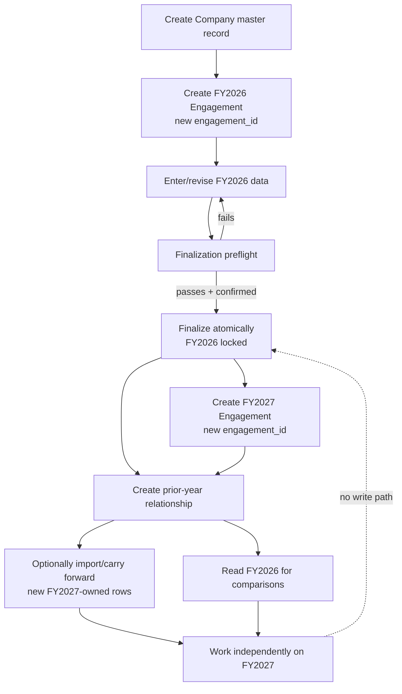
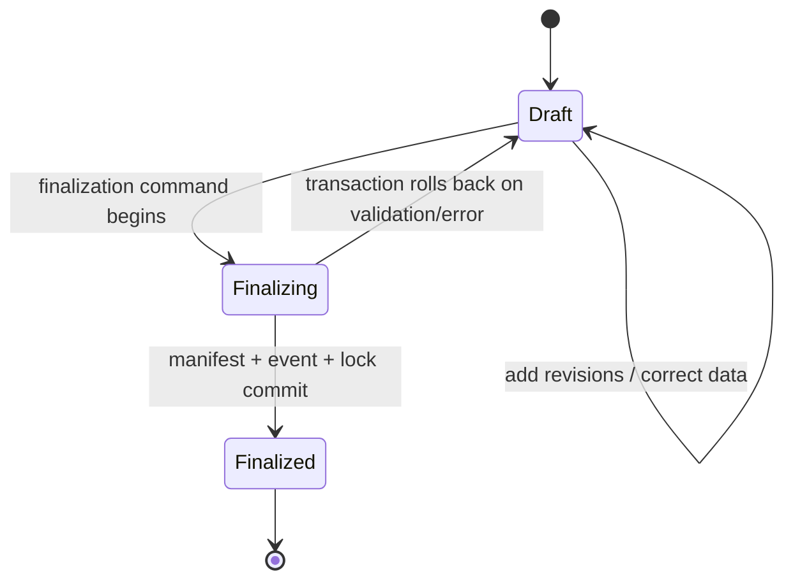
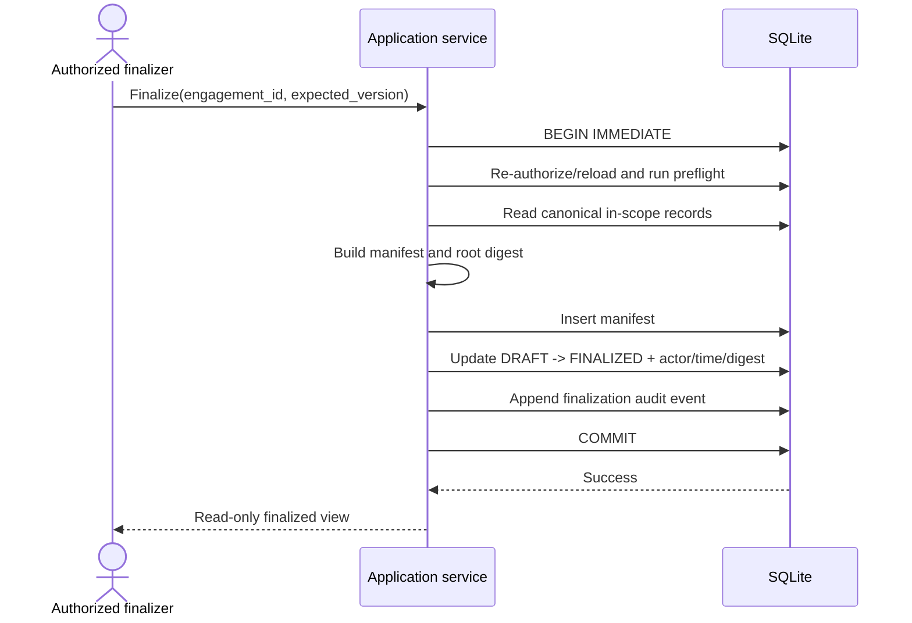

# Audit-Year Lifecycle

## 1. Engagement is the lifecycle boundary

A company persists across years; each engagement has its own lifecycle and owned data. FY2027 does not succeed FY2026 by updating FY2026's year. It is a new aggregate with a new ID and, optionally, one explicit relationship to finalized FY2026.

## 2. States

### MVP state machine

`Finalizing` is a transactional operation state, not necessarily persisted. Other requests should observe either `DRAFT` or `FINALIZED`, never a partial lock.

### Future states

`ABANDONED` may close an unused draft without deleting it. Review/sign-off workflow could add controlled substates before finalization. “Reopened” is not assumed: governance may instead require a correction package or superseding version that preserves the originally finalized snapshot.

## 3. Create engagement

Inputs: company, period start/end, label, optional eligible prior engagement.

Within one transaction:

1. authorize creation and verify company active;
2. validate period and company/period uniqueness;
3. insert engagement as `DRAFT` with immutable identity fields;
4. if requested, validate prior is different, same-company, earlier, and finalized;
5. insert immutable `prior_year_relationship`;
6. optionally create minimal current-year account shells as new engagement-owned records; and
7. append engagement-created and prior-linked audit events.

A failed step rolls back all steps. The service returns the new ID; it never changes the prior engagement.

## 4. Work in draft

A draft engagement may receive new account records and financial-data revisions. Every command:

- requires the target `engagement_id` explicitly;
- checks actor permission and engagement state;
- validates child record ownership;
- checks expected `row_version`/latest revision to reject stale tabs;
- inserts a revision rather than overwriting financial history; and
- writes its audit event in the same transaction.

Every workspace screen prominently shows company, period, `DRAFT`, and linked prior-year source.

## 5. Finalization protocol

### Preflight checks

At minimum:

- engagement is `DRAFT` and actor has finalization permission;
- identifying period/company and required metadata are valid;
- no stale or incomplete mutation is in progress;
- account codes and financial revisions are internally consistent;
- all financial rows match their account's engagement;
- prior relationship still points to a finalized same-company earlier period;
- required backup policy is satisfied or a pre-finalization backup is created;
- database foreign-key/integrity checks pass as policy requires; and
- sufficient disk space exists for transaction/backup.

Future modules register their own completion checks (unresolved review notes, missing sign-offs, incomplete procedures, unreconciled TB, etc.).

### Confirmation

Show exact company, period, impact, and permanence. Require an intentional confirmation; do not use a default-selected checkbox. Optionally require recent authentication under policy.

### Atomic transaction

Any exception rolls back manifest, state, and event together. After commit, trigger guards deny changes to engagement-owned rows. Verify the root digest immediately and during later open/backup/restore operations.

### What remains editable?

No year-owned business data, prior link, identity, or finalization metadata. Company master data may be corrected independently with an audit event, but the finalized manifest/report metadata must preserve the historical snapshot where legally relevant. Operational annotations must not be smuggled into finalized content; a future post-finalization note feature needs a separate append-only namespace and policy.

## 6. Creating and using FY2027

Eligibility list contains only earlier finalized engagements for the same company. On selecting FY2026:

- create FY2027 with a fresh engagement ID;
- create relation `FY2027 -> FY2026`;
- keep relation one-way—FY2026 does not gain mutable child state;
- query FY2026 read-only for comparisons;
- create/copy selected structures into FY2027 under fresh IDs; and
- retain provenance if anything is rolled forward.

A relationship is not an instruction to inherit all data. Balances are comparative facts; current-year balances are entered/imported separately. Risks, programs, and working papers (future) require explicit selection and current-year reassessment.

## 7. Comparative values

For synthetic Revenue:

| Account | FY2026 finalized | FY2027 draft | Change | Change % |
|---|---:|---:|---:|---:|
| Revenue | 850,000,000 | 920,000,000 | +70,000,000 | +8.24% |
| Receivables | 180,000,000 | 210,000,000 | +30,000,000 | +16.67% |
| Inventory | 240,000,000 | 275,000,000 | +35,000,000 | +14.58% |

The view reads two independent aggregates. It does not cache these derived percentages into FY2026. Currency, sign conventions, decimals, account matching, and rounding are explicit policies.

## 8. Failure and edge cases

- **Prior year still draft:** cannot link; finalize it or create current year without a link.
- **Different company:** reject even if period and account codes appear compatible.
- **Same/later period:** reject.
- **Period gap:** allow only with a visible warning if policy permits; “prior” need not mean consecutive calendar year.
- **Prior zero/missing amount:** percentage is `N/A`; label new/missing distinctly.
- **Stale browser tab finalizes/edits:** optimistic check fails and reload is required.
- **Crash during finalization:** transaction rollback leaves Draft, or commit leaves complete Finalized; startup verifies.
- **Out-of-band database change:** digest/integrity mismatch causes safe warning/quarantine, never silent digest replacement.
- **Need to correct finalized data:** no ordinary edit. Follow a future governance-approved supersession/correction workflow.
- **Current engagement already linked:** MVP rejects replacement to avoid changing comparison lineage.

## 9. Roll-forward rules (future)

Roll-forward must be:

- explicit and previewed;
- selective by supported entity type;
- from the linked finalized source only (unless policy explicitly allows otherwise);
- copy-with-provenance using new current engagement IDs;
- idempotent/deduplicated;
- audited with selected/skipped/failed counts;
- marked for current-year owner/reviewer reassessment; and
- incapable of writing to the source.

Examples of candidates: account mapping structure, procedure templates, risk descriptions, and working-paper references. Prior balances are read for comparison; they are not made editable in current year. Prior conclusions/sign-offs must never be presented as current-year conclusions/sign-offs.

## 10. Lifecycle acceptance conditions

The lifecycle design is proven only when automated tests show:

1. a second year creates a distinct engagement and owned rows;
2. all supported write paths fail after finalization;
3. raw SQL attempts are rejected by guards while triggers exist;
4. a failed finalization leaves no partial metadata/event;
5. comparisons resolve only through the recorded relation;
6. current-year edits do not change prior row values, counts, revisions, digest, or metadata;
7. backup/restore preserves relationships, state, events, and digest verification; and
8. all demonstrations use synthetic records.
