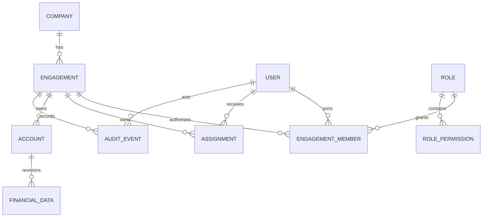
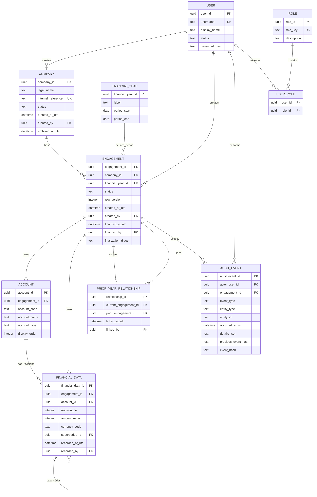

# Data model

> **Team-first revision:** The existing year model below is preserved and extended by `User`, data-driven `Role`/`RolePermission`, `EngagementMember`, and generic `Assignment`. Evidence/package objects remain future design.



**Implement now:** identity, roles/permissions, membership, assignments, existing financial/finalization/audit model, and concurrency tokens. **Design for future:** audit areas, procedures, working papers, review notes, and evidence metadata/bytes. See [team-architecture.md](team-architecture.md).

## 1. Modeling principle

`Company` and `Engagement` answer different questions:

- **Company:** “Who is the client?”—shared master data.
- **Engagement:** “What is the audit file for this reporting period?”—an isolated year-specific aggregate.

An engagement's financial year is identity-defining. It is never advanced by changing a year field. FY2027 is inserted as a new engagement and may reference FY2026.

## 2. Master data versus year-specific data

| Master/reference data | Engagement/year-owned audit data |
|---|---|
| Company identity and legal name | Accounts used for this year's data |
| Users | Financial values and their revisions |
| Roles and permissions | Prior-year relationship (owned by current engagement) |
| Financial-year period definition | Trial balance/import batches (future) |
| Application/schema metadata | Mapping, materiality, risks, plans (future) |
|  | Procedures, working papers, review notes (future) |
|  | Findings, conclusions, sign-offs, exports (future) |

A legal-name correction is a master-data change and is audited. Formal reports may need the company name snapshotted into engagement/finalization metadata so later master-data corrections do not rewrite the historical presentation. That snapshot is planned before report generation; it is not necessary for the narrow MVP.

## 3. Entity relationship diagram



`USER_ROLE` is shown because the User–Role many-to-many relation requires it, though the requested conceptual entities remain User and Role.

## 4. Conceptual tables

IDs should be application-generated UUIDs (stored consistently as 16-byte values or canonical text; decide before migration 001). All timestamps are UTC ISO-8601 values with the application clock abstracted for tests.

### `company` — master data

- `company_id` primary key
- `legal_name` required
- `internal_reference` required, unique, non-sensitive office identifier
- `status` (`ACTIVE`, `ARCHIVED`)
- creation and archive actor/timestamps
- optimistic `row_version`

No application hard delete. Archiving prevents new engagements by default but does not hide history.

### `financial_year` — reference data

- `financial_year_id` primary key
- `label` required (display only; dates are authoritative)
- `period_start`, `period_end`, with start ≤ end
- optional period type in future

A financial-year definition may be reused, but the company/year uniqueness lives on engagement. Labels need not be globally unique because “FY2026” can describe different date ranges; a unique `(period_start, period_end, label)` is sufficient. Once referenced it should not be edited in place; create/correct under controlled rules.

### `engagement` — aggregate root and lock boundary

- `engagement_id` primary key
- `company_id`, `financial_year_id` foreign keys
- `status`: initially `DRAFT`; `FINALIZED` is terminal in MVP
- `created_at_utc`, `created_by`
- `finalized_at_utc`, `finalized_by`, `finalization_digest`, `finalization_manifest_version`
- `row_version`

Constraints:

- unique `(company_id, financial_year_id)` for MVP;
- draft has null finalization fields;
- finalized has non-null actor/time/digest/version;
- identifying company/year cannot be changed after creation through ordinary application paths;
- engagement cannot be deleted.

If later standards require multiple audit types for one period, add an explicit `engagement_type`/sequence to the key—do not weaken uniqueness informally.

### `account` — year-specific classification

- `account_id` primary key
- `engagement_id` required
- `account_code`, `account_name`, `account_type`, `display_order`
- optional `source_account_id`/`source_engagement_id` for future roll-forward provenance
- unique `(engagement_id, account_code)`

The same business account in two years is represented by two account rows. Future mapping can use stable taxonomy/mapping master data, but balances remain engagement-owned.

### `financial_data` — append-only revisions

- `financial_data_id` primary key
- `engagement_id` required
- `account_id` required
- `revision_no` positive integer
- `amount_minor` signed 64-bit integer and `currency_code` (ISO code)
- `supersedes_id` nullable self-reference
- `recorded_at_utc`, `recorded_by`, optional correction reason
- optional source/provenance fields

A correction inserts revision N+1; old rows are not updated/deleted. “Current” is the highest revision for `(engagement_id, account_id)` (ties impossible under a unique constraint). Avoid a mutable `is_current` marker. The service verifies that `account.engagement_id` equals `financial_data.engagement_id`; a composite foreign key can enforce this by making `(account_id, engagement_id)` a referenced candidate key.

For the example's whole currency units, presentation converts according to configured scale. Exact percentage is computed from integer/decimal values and rounded only for display.

### `prior_year_relationship` — explicit historical source

- `relationship_id` primary key
- `current_engagement_id` unique and required
- `prior_engagement_id` required
- `linked_at_utc`, `linked_by`

Rules requiring cross-row inspection:

- current ≠ prior;
- both engagements belong to the same company;
- prior period ends before current period ends (normally immediately preceding, but gaps are allowed with warning);
- prior is `FINALIZED` at link time;
- link is immutable after current-year data exists (MVP should treat it as immutable from creation);
- no cycle.

Enforce through an application transaction plus SQLite triggers for same-company/finalized/order checks. The prior engagement remains independently queryable and locked.

### `audit_event` — append-only record of actions

- event ID, UTC timestamp, actor user ID (or narrowly defined system actor)
- event type and outcome
- optional engagement/company scope
- entity type/ID
- correlation/operation ID
- minimal structured JSON details (field names/revision IDs, not document contents or secrets)
- optional `previous_event_hash` and `event_hash`

No update/delete permissions are exposed. An audit event is committed in the same transaction as a successful mutation. Rejected security/finalization attempts may be recorded in a separate durable security log because the business transaction is rolled back. Hash chaining detects some tampering but does not prevent a filesystem owner from replacing both data and hashes; external signed backup manifests would strengthen assurance.

### `user`, `role`, and `user_role` — identity/access reference data

`user` has immutable ID, normalized unique username, display name, status, password-hash metadata, timestamps, and failed-login/lockout fields when local authentication is enabled. `role` has stable keys such as `PREPARER`, `REVIEWER`, `FINALIZER`, `WORKSPACE_ADMIN`; permissions should be policy-based rather than scattered string comparisons. Assignment changes are audited.

For an early engineering proof, a bootstrap actor may be configured, clearly marked non-production. MVP release hardening must replace it with local authentication or an approved OS-integrated identity design.

## 5. Derived query: comparisons

The comparison view does not copy prior balances merely to display them:

```text
current engagement
  -> latest financial_data revision per current account
  -> prior_year_relationship
  -> finalized prior engagement
  -> matched prior account (MVP: stable account code)
  -> latest prior financial_data revision
```

Derived values:

- `change_amount = current_amount - prior_amount`
- `change_percent = change_amount / abs(prior_amount) × 100` under an approved accounting convention
- if no matched prior amount: `NEW`/`N/A`
- if prior amount is zero: percentage `N/A`, with absolute change still shown

The matching policy is explicit. Stable account code is acceptable for the three-value MVP; future TB mapping requires durable account lineage/mapping, not name matching.

## 6. Finalization manifest and version history

A `finalization_manifest` (table or canonical serialized record) should include:

- engagement/company/period IDs;
- schema and manifest format versions;
- finalized actor/time;
- for each in-scope table: record IDs, revision identifiers, counts, and canonical content hashes;
- attachment hashes when attachments exist;
- prior-year relationship ID/source digest; and
- root digest calculated over deterministic UTF-8 canonical data.

Do not rely on SQLite physical-file hash because journaling/vacuuming can change bytes without changing business content.

Versioning has three layers:

1. **Record history:** append-only financial revisions (future documents/risks get explicit versions).
2. **Audit history:** append-only who/what/when events for operations.
3. **Finalized snapshot identity:** manifest/digest fixes exactly which revisions formed the final file.

A generic revision table may be introduced only if it preserves typed constraints and understandable queries. Module-specific versions are preferred for regulated business records.

## 7. Immutability enforcement

Defense in depth:

1. UI removes editing affordances and labels the engagement Finalized.
2. Application authorization/lifecycle policy rejects commands before mutation.
3. Repository requires engagement context and prevents unscoped writes.
4. SQLite triggers reject `INSERT`, `UPDATE`, and `DELETE` on every year-owned table when its engagement is finalized.
5. Triggers reject changes to identifying/finalization fields except the one valid `DRAFT -> FINALIZED` transition executed by the controlled finalization transaction.
6. Manifest verification detects out-of-band changes when opening/viewing/backing up a finalized engagement.
7. Audit and operational logs record detected integrity failures and protected-write attempts.

Triggers must account for both `OLD.engagement_id` and `NEW.engagement_id` so a row cannot be moved out of a locked engagement. New module migrations cannot ship until trigger coverage/finalization-manifest inclusion tests pass.

SQLite cannot stop a user with filesystem control and a separate SQLite tool from dropping triggers. OS access controls, full-disk encryption, backups, release integrity, and digest verification address that residual risk; stronger non-repudiation would require protected keys/external custody.

## 8. No deletion policy

- Company: archive, do not delete.
- Draft engagement: MVP does not delete; a future `ABANDONED` state can preserve it.
- Finalized engagement: never normal-delete; retention disposal requires a separately governed, evidenced operation.
- Financial data: supersede with a revision/correction; never erase.
- Audit events: append-only.
- Users: disable, preserving attribution.

## 9. Roll-forward model (future)

Roll-forward is a command with a selection manifest:

1. validate source is finalized and linked as prior;
2. select eligible structures (for example, account mapping or risk shell—not balances unless explicitly requested);
3. create new IDs and rows owned by current engagement;
4. stamp `source_engagement_id`, `source_entity_id`, and source version/digest;
5. mark content requiring current-year reassessment;
6. emit one parent event plus item outcome details; and
7. never synchronize subsequent current changes back to source.

The operation should be idempotent or detect duplicates, previewable, and transactional per defined batch. Prior-year working-paper references remain references to read-only historical content; editable current papers are copies/new versions.

## 10. Index and constraint outline

At minimum:

- unique company internal reference and normalized username;
- unique engagement `(company_id, financial_year_id)`;
- unique relationship `current_engagement_id`;
- unique account `(engagement_id, account_code)`;
- unique financial revision `(engagement_id, account_id, revision_no)`;
- composite FK from financial data `(account_id, engagement_id)` to account;
- indexes on engagement company/status, period dates, audit scope/time, and relationship prior ID;
- checks for enums, date order, positive revisions, valid currency format, and finalized metadata consistency.

All foreign-key delete actions should default to `RESTRICT`, not cascade, for business/audit records. Cascades may be used only for non-business ephemeral data with an explicit decision.
