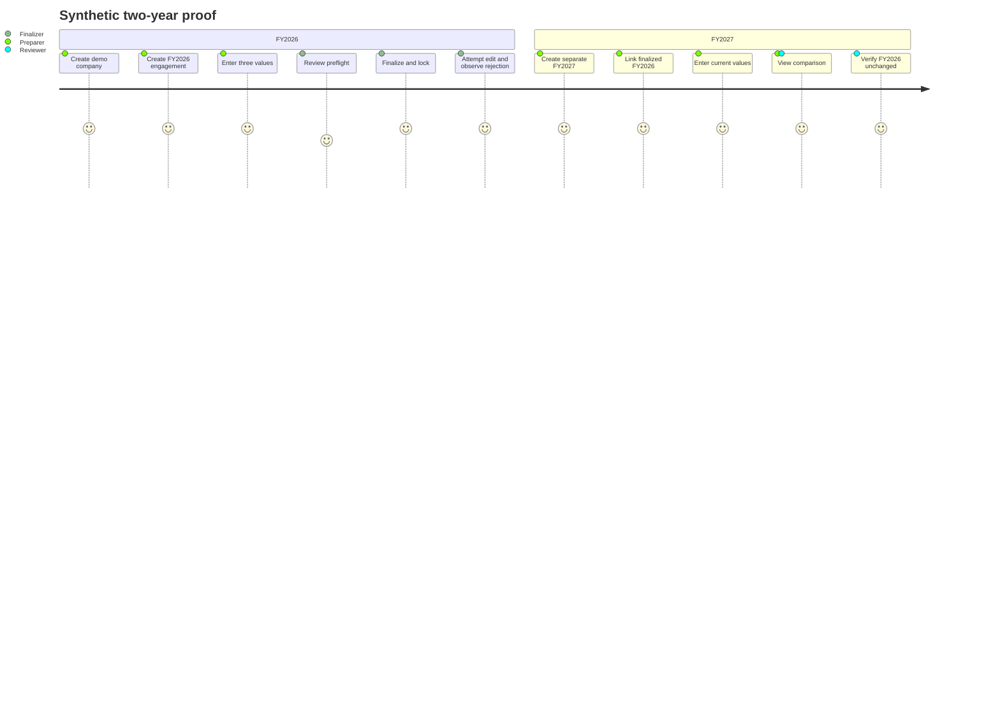

# MVP Scope

## 1. Goal

The MVP is an architectural proof that independent financial-year engagements can be created, finalized, protected, linked, and compared on a restricted local laptop. It is not yet a complete audit-management system.

### Success statement

An evaluator can create and finalize synthetic FY2026, create FY2027 linked to it, edit FY2027, see accurate comparisons, and obtain evidence that FY2026 has not changed and cannot be normally edited.

## 2. In scope

### User-visible capabilities

1. Start the packaged application without admin rights or internet and open its localhost UI.
2. Create a company with legal name and internal demo reference.
3. View a company and its engagement list, status, and period.
4. Create a draft financial-year engagement.
5. Enter/revise values for Revenue, Receivables, and Inventory (or an equivalent minimal account set).
6. View revision metadata for these values.
7. Run finalization preflight, confirm, and finalize.
8. View a finalized engagement in unmistakable read-only mode.
9. Create a later engagement and select an eligible finalized prior engagement.
10. View current/prior values, absolute changes, and percentages.
11. Perform a consistent backup and validated restore.
12. View basic audit events and finalization actor/time/digest status.

### Foundation capabilities

- self-contained .NET release proof;
- loopback-only host and anti-forgery/Host/Origin controls;
- SQLite schema migrations and integrity settings;
- engagement-scoped application commands/queries;
- exact money representation;
- append-only financial revisions and audit events;
- application and database finalized-write guards;
- deterministic finalization manifest/digest;
- current actor abstraction and permission policies, with release-appropriate local authentication during hardening;
- synthetic fixtures only.

## 3. Explicitly out of scope

- trial-balance spreadsheet import and reconciliation;
- full chart-of-accounts mapping;
- materiality, risk assessment, planning, audit programs/procedures, sampling;
- uploaded evidence, working-paper editor, references, review notes;
- findings, management responses, sign-off chains;
- full roll-forward UI/logic beyond demonstrating a prior link and possibly copying minimal account shells;
- Excel, PDF, and Word output;
- multi-user concurrent access or network hosting;
- cloud sync, web accounts, mobile clients, telemetry, auto-update;
- configurable workflow designer;
- hard deletion, retention disposal, legal hold;
- ordinary reopening/unfinalizing;
- claims of regulatory compliance or cryptographic non-repudiation.

These exclusions prevent a prototype from implying assurance it has not earned.

## 4. Demo scenario and expected output

All data is synthetic and labelled Demo.

**ABC Manufacturing (Demo), FY2026**

- Revenue: 850,000,000
- Receivables: 180,000,000
- Inventory: 240,000,000

Finalize FY2026, then create **FY2027**, link FY2026, and enter:

- Revenue: 920,000,000
- Receivables: 210,000,000
- Inventory: 275,000,000

Expected comparison:

| Account | FY2026 | FY2027 | Absolute change | Change % |
|---|---:|---:|---:|---:|
| Revenue | 850,000,000 | 920,000,000 | +70,000,000 | +8.24% |
| Receivables | 180,000,000 | 210,000,000 | +30,000,000 | +16.67% |
| Inventory | 240,000,000 | 275,000,000 | +35,000,000 | +14.58% |

Display rounding is two decimal places; stored amounts are exact. The accepted accounting sign/denominator convention must be locked before implementation.

## 5. Acceptance criteria

### Year isolation

- FY2026 and FY2027 have different engagement IDs.
- Every account/value is directly scoped to exactly one engagement.
- Changing FY2027 value/revision does not change FY2026 rows, counts, digest, status, actor, or timestamps.
- The comparison uses the explicit relationship, not “year minus one” guessing or global current-year state.
- Cross-company and non-finalized prior links are rejected.

### Finalization

- Only Draft can finalize; finalization is atomic and idempotently rejects repeats.
- Validation failure or induced crash leaves no partial Finalized state.
- UI offers no finalized edit/delete controls.
- Service/repository commands reject account/value/prior-link modifications.
- SQLite triggers reject direct insert/update/delete against finalized engagement-owned records.
- Finalization manifest verifies after restart, backup, and restore.
- No unfinalize path exists.

### Audit/history

- Draft corrections append revisions.
- Each successful business mutation and finalization emits an attributable event in the same transaction.
- No company, engagement, value revision, user attribution, or event can be silently hard-deleted through the application.
- UTC times and actor identities are displayed/auditable.

### Portability and security

- Runs from an extracted user-writable folder on a clean supported Windows account without admin, separately installed .NET, Docker, database server, internet, or service.
- Listens only on loopback and rejects forged host/origin/CSRF requests.
- Workspace survives application binary replacement/upgrade according to the tested migration procedure.
- Backup is consistent; tampered/incompatible backup is rejected; restore is staged and verified.
- Logs and fixtures contain no real client data, credentials, or document content.

## 6. MVP user journey

## 7. Testing matrix

| Area | Required proof |
|---|---|
| Domain | Valid/invalid periods, lifecycle transitions, percentage/rounding, eligibility |
| Persistence | FKs, unique/check constraints, composite ownership FK, trigger guards, migration from empty DB |
| Application | Permission/state/ownership checks; event and mutation atomicity; stale version rejection |
| Finalization | canonical deterministic digest; rollback fault injection; every owned table protected |
| Prior year | same-company/finalized/earlier checks; no cycles; no source writes; missing/zero comparisons |
| Backup | online consistent snapshot; manifest/checksum; corrupt package rejection; staged restore |
| UI | clear context/status, keyboard flow, CSRF, no finalized controls, accurate formatting |
| Packaging | clean non-admin/offline Windows VM, paths with spaces/non-ASCII, abrupt termination/restart |
| Data hygiene | fixture and repository scan; only synthetic Demo records |

A special invariant test should enumerate EF model entities marked engagement-owned and fail if any lacks `engagement_id`, finalized-write guard coverage, manifest inclusion policy, or an explicit documented exemption.

## 8. Implementation phases

### Phase 0 — specification approval

- Review terminology, invariants, money/currency policy, authentication posture, backup destination, retention assumptions, and finalization authority.
- Convert acceptance criteria into traceable test cases.
- Exit: architecture decision sign-off; no unresolved issue that could invalidate engagement identity.

### Phase 1 — portable technical skeleton

- Create solution/project boundaries and CI quality gates.
- Prove self-contained ZIP starts offline/non-admin and binds loopback.
- Implement workspace selection/versioning, SQLite connection policy, migration harness, synthetic-data guard, and diagnostics.
- Exit: clean-machine portability and empty-workspace backup proof.

### Phase 2 — core model and audit pipeline

- Implement Company, FinancialYear, Engagement, User/Role boundary, AuditEvent.
- Add constraints, optimistic concurrency, transaction/event pipeline, company and engagement pages.
- Exit: data model integration/architecture tests pass; no year-specific unscoped writes.

### Phase 3 — financial revisions and comparison

- Implement engagement accounts, append-only values, exact calculations, relationship validation, and comparison query/UI.
- Seed only the opt-in synthetic demo.
- Exit: two independent drafts and comparison edge cases pass.

### Phase 4 — finalization and immutability

- Implement preflight registry, confirmation, canonical manifest/digest, database triggers, read-only views, fault-injection and tamper detection.
- Exit: protected-write matrix and crash atomicity pass at UI, service, repository, and SQL levels.

### Phase 5 — identity, backup, and MVP hardening

- Complete approved local authentication/RBAC, session/security headers, backup/restore packaging, log redaction, accessibility, threat tests, and signed/checksummed packaging.
- Run restore drill and user acceptance scenario.
- Exit: confidential-data deployment review; documentation and known residual risks approved.

Do not combine later audit modules into these phases. Establish the year boundary before expanding breadth.

## 9. Definition of done

MVP is done when all acceptance criteria are automated where feasible, the exact demo passes offline on representative corporate hardware, a backup has been restored on a clean profile, security/architecture review has no blocking finding, and documentation accurately describes limitations. A polished mock UI without database-level isolation is not an MVP success.
