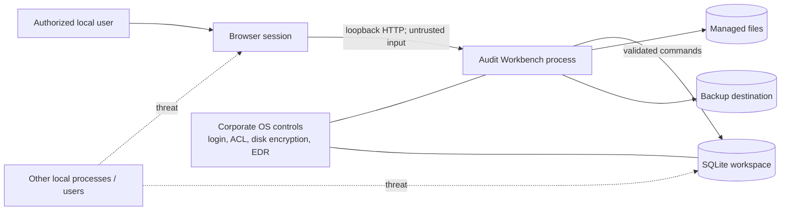

# Security model

> **Team-first revision:** Production trust moves to the central Application/API. It authenticates requests server-side and resolves `ICurrentActor`; command-supplied actor IDs are never trusted. An active account has no engagement access without active `EngagementMember` plus permission. The local-device controls below remain relevant to the preserved local-development MVP, not sufficient production controls. See [team-architecture.md](team-architecture.md).

## 1. Objectives and limits

Audit Workbench must preserve confidentiality, integrity, availability, accountability, and year separation on a managed local laptop. Local-only is exposure reduction, **not** a complete security model. Malware, an unlocked Windows session, a user with filesystem access, unauthorized backup copies, or a compromised application binary can still expose or alter data.

Security controls combine application policy, database constraints, operating-system controls, corporate endpoint management, verified backups, and user procedure.

## 2. Assets and trust boundaries

### Assets

- company identities and financial/audit data;
- future evidence and working-paper attachments;
- user credentials and sessions;
- audit/version/finalization records;
- backup packages and recovery material;
- application/migration binaries and configuration.

### Boundaries

The browser is an untrusted input source even on localhost. The filesystem is not assumed tamper-proof.

## 3. Principal threats and controls

| Threat | Primary controls |
|---|---|
| Another device reaches the app | Bind loopback only; reject non-loopback connections; Host/Origin allowlist; firewall is supplementary |
| Local web page sends forged requests | SameSite/HttpOnly/Secure-where-applicable cookies, anti-forgery tokens, origin validation, no permissive CORS |
| Unauthorized person uses open session | Authentication, short idle timeout/lock, explicit logout, OS screen lock |
| User accesses a prohibited action | Server-side policy authorization per use case; roles; deny by default; audited assignment |
| Cross-year data leakage/update | Mandatory engagement scoping, explicit IDs, same-company validation, repository filters, integration tests |
| Finalized data is changed | App lifecycle guard, SQLite write-denial triggers, terminal state, canonical digest verification, audit events |
| Database/backup copied | Corporate full-disk/device encryption, restrictive ACLs, encrypted approved backup destination, data-handling procedures |
| Database corruption/ransomware | Transactional SQLite settings, integrity checks, versioned offline backups, restore drills |
| Dependency/release compromise | Locked dependencies, SBOM, vulnerability/license scan, signed/checksummed releases, controlled update source |
| Sensitive details leak to logs | Structured metadata-only logging, redaction, bounded retention, support-bundle exclusion |
| Data silently disappears | No hard delete, revisions, audit events, restrictive FKs, backup/restore |

## 4. Authentication design

### MVP posture

Do not build an elaborate identity platform before validating the engagement model. During a non-production engineering prototype, an explicit bootstrap/demo actor may supply `CurrentUser` so records are attributable. It must be visibly marked unsafe for confidential data and impossible to mistake for a production mode.

Before the MVP is approved for confidential use, implement one approved local authentication option:

1. **Preferred when corporate policy supports it:** Windows integrated identity, while still maintaining an application `User` record and roles.
2. **Portable fallback:** local username/password with a maintained .NET adaptive password hasher, per-password salt, algorithm/work-factor metadata, lockout/backoff, password change, and a controlled offline recovery process.

No plaintext, reversible, default, or logged passwords. Do not invent cryptography. Password policy and recovery must align with corporate policy. A workspace-local account protects through the app but does not protect a stolen unencrypted database; device encryption remains necessary.

### Sessions

- Generate a fresh high-entropy session at login/startup; rotate at authentication and privilege change.
- Cookie is `HttpOnly`, `SameSite=Strict`, narrowly scoped, and `Secure` when local HTTPS is operational. If HTTP loopback is used, document the browser/OS limitation and rely on loopback plus anti-forgery controls; evaluate local HTTPS certificate operational burden before release.
- Enforce idle and absolute expiry appropriate to audit-office policy.
- Invalidate active sessions after account disable/credential reset where feasible.
- Never place credentials or durable bearer tokens in URL/query strings.

## 5. Authorization model

Use permission policies, not UI-only roles. Initial conceptual roles:

| Capability | Preparer | Reviewer | Finalizer | Workspace Admin |
|---|---:|---:|---:|---:|
| View authorized engagements | Yes | Yes | Yes | Operationally as approved |
| Edit draft financial data | Yes | Optional | Optional | No implicit business access |
| Review/comment (future) | No | Yes | Yes | No |
| Finalize after preflight | No | Optional by policy | Yes | No implicit right |
| Manage users/roles | No | No | No | Yes |
| Backup/restore | No | No | Optional | Yes |
| Edit finalized data | Never | Never | Never | Never through normal workflow |

For a single-user first release one user may hold multiple roles, but permission checks remain. Workspace administration does not automatically confer audit content privileges; whether strict separation is practical on one laptop is a governance decision.

Every command checks: authenticated actor, permission, company/engagement access, lifecycle state, optimistic version, and input validity. Query authorization is as important as command authorization.

## 6. Engagement and finalization protection

- Always derive/query data under explicit `engagement_id`; avoid global “current year” mutable state.
- Validate nested IDs belong to that engagement to prevent insecure direct-object references.
- Finalization requires explicit permission, recent authentication if policy requires it, preflight success, clear confirmation, and one atomic transaction.
- Database triggers deny writes against finalized owners even if a code path omits a check.
- On open and backup, verify the finalized manifest/digest. Quarantine/flag discrepancies; do not silently recalculate and bless them.
- No MVP unfinalize function. Future exceptional handling needs approval reason, dual authorization where required, event trail, preserved original manifest, and preferably a superseding engagement/version rather than mutation.

## 7. Audit trail

Audit events should answer who, what, which record/engagement, when, result, and operation/correlation ID. Record:

- authentication and lockout events;
- company/engagement creation and company changes;
- financial-data revisions (old/new revision identifiers, not necessarily sensitive amounts);
- prior-year link and future roll-forward source/selection;
- finalization attempt, preflight failure summary, and success;
- authorization/finalized-write rejection where useful;
- role/user changes;
- backup, restore, migration, integrity failure, and export.

Successful mutation and event use the same transaction. Audit rows are append-only with restrictive database triggers. Use UTC internally and render local timezone explicitly. Clock rollback/tampering remains a local-device risk; future high-assurance operation may add trusted timestamping or externally retained signed audit checkpoints.

Hash chaining/tamper-evident finalization detects accidental/out-of-band modification but is not non-repudiation because a local filesystem administrator can replace data and unprotected keys. Documentation and UI must not overclaim.

## 8. Data at rest and in transit

### At rest

SQLite has no built-in transparent encryption in the chosen baseline. Required deployment controls:

- corporate-managed full-disk encryption (for example, BitLocker) and OS login;
- restrictive user-only ACL on workspace and temp folders;
- no live workspace on unapproved removable/network/sync storage;
- encrypted, access-controlled backup destination;
- prevent database/attachments in source control and ordinary support bundles;
- clear temporary export files and document unavoidable residual copies.

Evaluate SQLCipher or application-level envelope encryption as a separate decision only after licensing, key recovery, backup, search, migration, and endpoint-policy testing. Encryption without recoverable key management can reduce availability.

### Local transport

Bind only `127.0.0.1`/`::1`; validate Host and Origin and disable CORS unless narrowly needed. Local HTTPS protects against some same-device observation but introduces certificate trust/deployment complexity. Decide after corporate browser testing. Regardless of HTTP/HTTPS, use anti-forgery, CSP, output encoding, secure headers, and no external scripts/fonts/analytics.

## 9. Input, files, and exports

For MVP, server-side validate lengths, enums, dates, exact numeric ranges, IDs, and ownership. Use parameterized ORM/SQL and encoded output.

Before future uploads/imports:

- allowlisted file types and size/count limits;
- generated storage names outside web root; never trust original path/name;
- archive-bomb/macro/content handling and antivirus integration per policy;
- hash and record source metadata;
- parse in a constrained process where practical;
- spreadsheets treated as untrusted; exports protect against formula injection;
- Office/PDF generation libraries undergo license and security review.

## 10. Backup, restore, retention, and disposal

- Backup is explicit, consistent, checksummed, versioned, and auditable.
- Package encryption uses approved authenticated encryption/tooling with recovery documented separately from the package.
- Keep multiple generations and at least one policy-approved offline/immutable copy where required.
- Restore into staging; verify checksums, manifest, schema, SQLite integrity, foreign keys, and finalized digests before activation.
- Test restoration on a schedule and record evidence.
- Retention/legal-hold and secure disposal are policy-driven future workflows. “Delete file” is not guaranteed secure erasure on SSDs; rely on encrypted media/key destruction and corporate disposal controls.

## 11. Secure development and release

- Synthetic data only; secret scanning and dependency vulnerability/license scanning in CI.
- Branch review and protected release process; reproducible/versioned builds where practical.
- Generate an SBOM and publish release checksums/signature through an approved channel.
- Pin dependencies and minimize JavaScript/package footprint; no runtime CDN assets.
- Threat-model each new module, especially import, attachment, export, identity, and shared deployment.
- Security and data migrations receive independent review and rollback/recovery tests.
- Never send telemetry, crash dumps, or update checks externally without explicit organizational approval and opt-in.

## 12. Incident behavior

On integrity verification failure, migration mismatch, suspected workspace duplication, or backup corruption, default to safe read-only/quarantine behavior. Explain the condition without exposing sensitive data, preserve logs, avoid automatic “repair” that destroys evidence, and direct the custodian to a documented recovery workflow.
