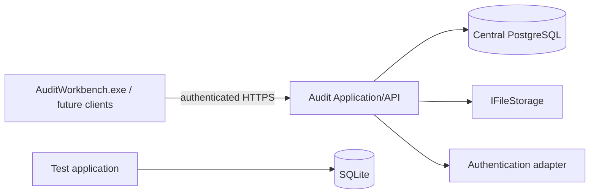

# Team-first architecture

## Production topology

The server is the trust boundary. Clients do not select an actor ID, connect directly to the database, or authorize themselves. `ICurrentActor` is populated by a server-side authentication adapter and resolves to an active `User`. In claims mode, `HttpCurrentActor` reads only the authenticated server `ClaimsPrincipal` (`NameIdentifier`/`sub`); submitted IDs cannot select the actor. Local development uses the visibly unsafe `LocalActor`; it is not a production authentication design.

## Implement now

- `User` is independent of engagements and authentication mechanism.
- `Role` has data-driven `RolePermission` rows. Seed roles are Partner, Manager, Senior, Auditor, Reviewer, and ReadOnly; they are initial policy, not immutable domain enums.
- `EngagementMember` links exactly one user and role to one engagement. Only active users with active membership are considered.
- `EngagementAuthorizationService` evaluates membership and permission together, deny-by-default.
- Engagement creators receive an explicit Partner membership; creating an account gives no access to any engagement.
- `CompanyAuthorizationService` filters client metadata through authorized engagements; creating another period requires client management authority, preventing self-granted Partner access by changing a client ID.
- `Assignment` is an engagement-owned, optimistic-concurrency-protected reference to an active member and a generic scope (`ENGAGEMENT`, `AUDIT_AREA`, `WORKING_PAPER`, or `PROCEDURE`). Members see their own assignments; assignment managers see the engagement list. No future audit module is implemented.
- Team and assignment mutations, including reassignment, are audited and become immutable with the finalized year. Database guards prevent moving historical membership/assignment identity across engagements.

Initial permission keys are `VIEW_ENGAGEMENT`, `EDIT_ENGAGEMENT`, `MANAGE_TEAM`, `MANAGE_ASSIGNMENTS`, `EDIT_WORKING_PAPERS`, `UPLOAD_EVIDENCE`, `REVIEW_WORKING_PAPERS`, `CLEAR_REVIEW_NOTES`, `FINALIZE_ENGAGEMENT`, `EXPORT_ENGAGEMENT`, `IMPORT_ENGAGEMENT`, and `VIEW_AUDIT_TRAIL`.

## Design for future

- Deployment-specific ASP.NET Core cookie/OIDC or Windows/AD authentication handlers feeding the implemented claims actor adapter.
- Administration UI and role customization/governance.
- Audit-area/procedure/working-paper targets behind the existing assignment scope contract.
- API-wide policy filters. New commands and queries must call the engagement authorization policy; UI visibility is never a control.

Company creation and user provisioning are system-level administrative concerns and require a separate platform policy before production rollout.
